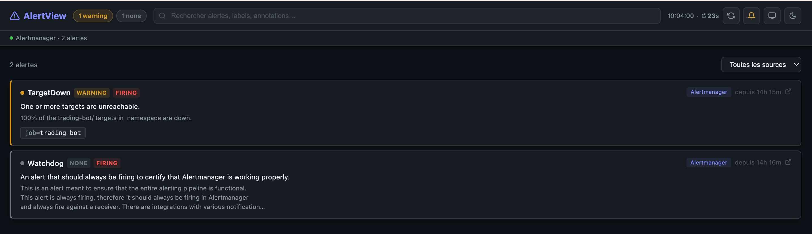

# AlertView

A lightweight alert dashboard for Alertmanager, Grafana and Zabbix. Built with Rust (Axum) and a single-page HTML frontend — no database, no dependencies at runtime.

> ⚠️ **Security:** AlertView has no built-in authentication and binds to `0.0.0.0`. Its `/api/alerts` endpoint exposes alert data (hostnames, labels, messages). **Never expose it directly to an untrusted network** — always place it behind a reverse proxy with authentication and TLS (see [Reverse proxy](docs/deployment/reverse-proxy.md)).

**Features:**
- Aggregates alerts from multiple Alertmanager, Grafana and/or Zabbix sources
- Severity-colored cards (critical / error / high / warning / info), ranking configurable via `display.severity_order`
- Clickable alerts with a link built from their labels (`display.alert_link_template`), independent from the ↗ "open in the source" button
- Labels shown in front of the alert name (`display.prefix_labels`)
- Automatic light/dark theme following the OS, TV mode startable by default
- Filter by severity, status (firing / silenced / pending), and source
- Multi-source filter chips
- Direct links to specific alerts (Zabbix uses `filter_eventid`, Alertmanager/Grafana use `generator_url`)
- TV mode for wall displays — full-screen, auto-refresh, URL-persisted filters
- Dark/light theme with **custom CSS support**
- **Automatic config reload** — changes to the config file are detected and applied without restart
- **Sound notifications** for new alerts (using Web Audio API)
- **Timezone support** (local, UTC, or any IANA timezone)
- **Response caching** with configurable TTL
- **Retry logic** with exponential backoff per source
- **Gzip compression** for API responses
- **Health check endpoint** (`/health`)
- **Installable as a PWA** — add AlertView to your home screen on Android, iOS or desktop (standalone, full-screen)

## Table of Contents
- [Requirements](#requirements)
- [Configuration](#configuration)
- [Environment Variables](#environment-variables)
- [Running Locally](#running-locally)
- [Docker](#docker)
- [Kubernetes Deployment](#kubernetes-deployment)
- [Install as an App (PWA)](#install-as-an-app-pwa)
- [API](#api)
- [Tests](#tests)

## Requirements

- Rust 1.75+ (build only)
- Docker (optional, for containerized deployment)

## Configuration

Copy `config.example` to `config.yaml` and edit it. The config file is automatically reloaded when modified.

### Full Configuration Example

This example shows all available options:

```yaml
port: 8080
refresh_interval: 30   # seconds between auto-refreshes
tls_insecure: false    # set true to skip TLS verification (self-signed certs)

sources:
  - name: "Alertmanager"
    type: alertmanager
    url: "http://alertmanager.monitoring.svc.cluster.local:9093"
    dashboard_url: "https://grafana.example.com/alerting/list"  # optional link on cards
    severity_label: "severity"   # label used to classify severity (case-insensitive, default: "severity")

  - name: "Grafana"
    type: grafana
    url: "http://grafana.monitoring.svc.cluster.local:3000"
    bearer_token: "glsa_xxxx"   # Grafana service account token
    # or: basic_auth: { username: admin, password: secret }

  - name: "Zabbix"
    type: zabbix
    url: "https://zabbix.example.com/zabbix"
    bearer_token: "YOUR_ZABBIX_TOKEN_HERE"  # Zabbix API token
    dashboard_url: "https://zabbix.example.com/zabbix/zabbix.php?action=problem.view"

display:
  labels:          # which labels to show on each alert card
    - namespace
    - job
    - instance
    - host
    - hostgroup
```

### Minimal Configuration Examples

**Alertmanager only:**
```yaml
sources:
  - name: "Alertmanager"
    type: alertmanager
    url: "http://localhost:9093"
```

**Grafana only:**
```yaml
sources:
  - name: "Grafana"
    type: grafana
    url: "http://localhost:3000"
    bearer_token: "your_token_here"
```

**Zabbix only:**
```yaml
sources:
  - name: "Zabbix"
    type: zabbix
    url: "http://zabbix-server/zabbix"
    bearer_token: "your_zabbix_token"
```

> **Note for Zabbix**: Direct alert links require `filter_set=1&filter_eventid=<ID>` parameters, which are automatically added by AlertView.

### Display Configuration

Customize the display of alerts:

```yaml
display:
  # Labels to show on each alert card
  labels:
    - namespace
    - job
    - instance
    - host
    - hostgroup
  
  # Theme: "dark", "light", or URL to custom CSS file
  # theme: "dark"
  
  # Timezone: "local", "UTC", or any IANA timezone (e.g., "Europe/Paris", "America/New_York")
  # timezone: "local"
  
  # Enable sound notifications for new alerts (uses Web Audio API)
  # Different sounds for each severity level (critical, high, warning, info)
  # play_sounds: false
```

### Per-Source Configuration

Each source supports additional configuration:

```yaml
sources:
  - name: "Alertmanager"
    type: alertmanager
    url: "http://alertmanager.example.com:9093"
    timeout: 30  # seconds (default: 15)
    link_template: "https://grafana.com/alerts?query={{.Labels.alertname}}"
    retry_policy:
      max_retries: 5  # default: 3
      initial_delay_ms: 2000  # default: 1000 (1 second)
      max_delay_ms: 60000  # default: 30000 (30 seconds)
```

**Link Template Variables:**
- `{{.Labels.<key>}}` - Any label value (e.g., `{{.Labels.namespace}}`)
- `{{.Annotations.<key>}}` - Any annotation value (e.g., `{{.Annotations.summary}}`)
- `{{.Fingerprint}}` - Alert fingerprint
- `{{.Source}}`, `{{.SourceType}}`, `{{.Status}}`, `{{.Severity}}`, `{{.Name}}`
- `{{.StartsAt}}`, `{{.EndsAt}}` - Timestamps

### Caching

Enable response caching to reduce load on your alert sources:

```yaml
# Global cache TTL in seconds (0 = disabled)
cache_ttl_seconds: 60
```

> `config.yaml` is gitignored — never commit credentials.

## Environment Variables

AlertView can be configured entirely through environment variables:

| Variable | Default | Description |
|---|---|---|
| `ALERTVIEW_PORT` | 8080 | Port to listen on |
| `ALERTVIEW_REFRESH_INTERVAL` | 30 | Seconds between auto-refreshes |
| `ALERTVIEW_CACHE_TTL` | 0 | Cache TTL in seconds (0 = disabled) |
| `ALERTVIEW_LOG_FORMAT` | text | Log format: `text` or `json` |

**Example:**
```bash
# Run with environment variables
ALERTVIEW_PORT=9090 ALERTVIEW_LOG_FORMAT=json cargo run

# Or with Docker
docker run -e ALERTVIEW_PORT=9090 -e ALERTVIEW_LOG_FORMAT=json -p 9090:9090 alertview
```

## Running locally

```bash
cargo run -- config.yaml
# open http://localhost:8080
```

**Note:** The config file is automatically reloaded when modified. No restart needed.

## Docker

### Build and Run

```bash
# Build the image
docker build -t alertview .

# Run with config file mounted (use :rw for auto-reload to work)
docker run -p 8080:8080 -v $(pwd)/config.yaml:/config/config.yaml:rw alertview
```

> **Note:** Use `:rw` (read-write) mount option to enable automatic config reload. With `:ro` (read-only), config changes won't be detected.

### Pre-built Images

The image is also published automatically to GHCR on every push to `main`:

```bash
# Pull the latest image
docker pull ghcr.io/frakev/alertview:latest

# Run it
docker run -p 8080:8080 -v $(pwd)/config.yaml:/config/config.yaml:rw ghcr.io/frakev/alertview:latest
```

### Docker Compose

Example `docker-compose.yml`:

```yaml
version: '3.8'
services:
  alertview:
    image: ghcr.io/frakev/alertview:latest
    ports:
      - "8080:8080"
    volumes:
      - ./config.yaml:/config/config.yaml:rw
    restart: unless-stopped
```

Run with: `docker compose up -d`

## Kubernetes Deployment

The Kubernetes manifests (prefixed with numbers: `01-namespace.yaml`, `02-configmap.yaml`, etc.) deploy AlertView into its own namespace using a ConfigMap for configuration.

### Prerequisites

- Kubernetes cluster
- `kubectl` configured to access your cluster
- (Optional) Ingress controller if using the ingress manifest

### Configuration Files

| File | Purpose | What to change |
|---|---|---|
| `01-namespace.yaml` | Creates the `alertview` namespace | Usually no changes needed |
| `02-configmap.yaml` | Configuration (sources, tokens, URLs) | Alertmanager/Grafana/Zabbix URLs, dashboard links, tokens |
| `03-deployment.yaml` | Deployment configuration | Resource limits, replicas |
| `04-service.yaml` | Service (ClusterIP) | Port, service type |
| `05-ingress.yaml` | Ingress for external access | Your domain, TLS secret name, annotations |

### Deploy

**Method 1: Apply manifests individually**
```bash
kubectl apply -f 01-namespace.yaml
kubectl apply -f 02-configmap.yaml
kubectl apply -f 03-deployment.yaml
kubectl apply -f 04-service.yaml
kubectl apply -f 05-ingress.yaml
```

**Method 2: Use the Makefile**
```bash
# For standard kubectl
make deploy

# For microk8s
KUBECTL=microk8s kubectl make deploy

# For other custom kubectl
KUBECTL=/path/to/your/kubectl make deploy
```

### Update Configuration

For local deployments (binary or Docker), the config file is automatically reloaded when modified.

**For Kubernetes deployments**, since ConfigMaps are mounted as read-only volumes, you need to restart the deployment after changing the ConfigMap:

```bash
# Apply the updated configmap
kubectl apply -f 02-configmap.yaml

# Restart the deployment to pick up changes
kubectl rollout restart deployment/alertview -n alertview

# Or use the Makefile
make restart
```

> **Note:** The automatic config reload feature does not work with Kubernetes ConfigMaps because they are mounted as read-only. Consider using a sidecar like `configmap-reload` or mounting the config from an emptyDir volume with an initContainer that copies from the ConfigMap.

### Access the Dashboard

After deployment:
- **Internal access**: `http://alertview.alertview.svc.cluster.local:8080`
- **External access** (if ingress configured): `https://your-domain.com`

Check pods and service:
```bash
kubectl get all -n alertview
```

## CI/CD

The included `.github/workflows/docker-publish.yml` builds and pushes the image to GHCR on every push to `main` and on version tags (`v*`). It uses `GITHUB_TOKEN` — no extra secrets required.

```
push to main  →  ghcr.io/frakev/alertview:main
push v1.2.3   →  ghcr.io/frakev/alertview:1.2.3 + :latest
```

The workflow targets a `self-hosted` runner labeled `k8s-home`. Change `runs-on` in the workflow file if your runner has a different label.

## Install as an App (PWA)

AlertView is a [Progressive Web App](https://web.dev/progressive-web-apps/), so it can be installed
on a phone, tablet or desktop and launched like a native app — full-screen, with its own icon and no
browser address bar.

### Android (Chrome)

1. Open AlertView in Chrome over **HTTPS** (e.g. `https://alerts.example.com`).
2. Open the **⋮** menu and tap **Install app** (or **Add to Home screen**). Chrome may also show an
   install banner automatically.
3. AlertView opens standalone from your home screen.

### iOS (Safari)

Open AlertView, tap the **Share** button, then **Add to Home Screen**.

### Desktop (Chrome / Edge)

Click the **install icon** in the address bar, or use the browser menu → **Install AlertView**.

### Requirements

- A **secure context** is required: this means **HTTPS**, or `http://localhost` for local testing.
  Plain-HTTP access over a LAN IP (e.g. `http://192.168.1.10:8080`) will not offer installation.
  The provided [Kubernetes ingress](05-ingress.yaml) already terminates TLS via cert-manager /
  Let's Encrypt — just point it at your own domain.

### How it works

The PWA assets are embedded in the binary and served from these routes:

| Route | Purpose |
|-------|---------|
| `/manifest.webmanifest` | App metadata (name, icons, standalone display) |
| `/sw.js` | Service worker (caches the static shell for fast/offline launch) |
| `/icons/*.png` | App icons (192px, 512px, maskable, apple-touch) |

> **Live data is never cached.** The service worker only caches the static app shell
> (HTML/CSS/JS/icons). Requests to `/api/*`, `/events` (SSE) and `/health` always go straight to the
> network, so alerts stay real-time.

## API

AlertView provides a simple REST API for programmatic access to alerts.

### Endpoints

| Method | Endpoint | Description |
|---|---|---|
| `GET` | `/` | Web UI dashboard |
| `GET` | `/api/alerts` | JSON — all alerts aggregated from all configured sources |
| `GET` | `/health` | Health check endpoint (returns "OK") |
| `GET` | `/style.css` | Dashboard stylesheet |
| `GET` | `/app.js` | Dashboard JavaScript |

> **Note:** All endpoints except `/health` support gzip compression automatically.

### `/api/alerts` Response Format

```json
{
  "alerts": [
    {
      "fingerprint": "source1:abc123",
      "source": "Alertmanager",
      "source_type": "alertmanager",
      "status": "firing",
      "severity": "critical",
      "name": "HighCPUUsage",
      "labels": {
        "namespace": "production",
        "job": "node-exporter",
        "instance": "server-1"
      },
      "annotations": {
        "summary": "High CPU usage detected",
        "description": "CPU usage is above 90% for 5 minutes"
      },
      "starts_at": "2024-01-15T10:30:00Z",
      "ends_at": null,
      "link_url": "https://grafana.example.com/alerting/list"
    }
  ],
  "sources": [
    {
      "name": "Alertmanager",
      "status": "ok",
      "alert_count": 5,
      "error": null
    }
  ],
  "refresh_interval": 30,
  "display_labels": ["namespace", "job", "instance"],
  "timezone": "local",
  "theme": null,
  "play_sounds": false
}
```

**Additional response fields:**
- `timezone`: Current timezone setting (from config)
- `theme`: Current theme setting (from config, null if default)
- `play_sounds`: Whether sound notifications are enabled

### Response Fields

**Alert object:**
- `fingerprint`: Unique identifier (format: `{source}:{internal_id}`)
- `source`: Name of the source as configured
- `source_type`: One of `alertmanager`, `grafana`, `zabbix`
- `status`: One of `firing`, `silenced`, `pending`
- `severity`: One of `critical`, `error`, `high`, `warning`, `info`, `none`, or any level listed in `display.severity_order`
- `name`: Alert name
- `labels`: Object with alert labels
- `annotations`: Object with alert annotations
- `starts_at`: RFC3339 timestamp when alert started
- `ends_at`: RFC3339 timestamp when alert ended (null if still active)
- `link_url`: Direct link to the alert in the source dashboard (if configured)

**SourceStatus object:**
- `name`: Source name
- `status`: `ok` or `error`
- `alert_count`: Number of alerts from this source
- `error`: Error message if status is `error`, otherwise null

### HTTP Status Codes

- `200 OK`: Success
- `500 Internal Server Error`: Failed to fetch from one or more sources (partial results may still be returned)

## Tests

AlertView includes unit tests for configuration parsing and link template rendering:

```bash
# Run all tests
cargo test

# Run with coverage (requires cargo-tarpaulin)
cargo tarpaulin --out Html
```

The tests verify:
- Configuration file loading and parsing
- Default values for all config options
- Source-specific configuration (timeout, retry policy)
- Link template rendering with various placeholders
- Display configuration (theme, timezone, labels)

## License

AlertView is released under the [MIT License](LICENSE).
