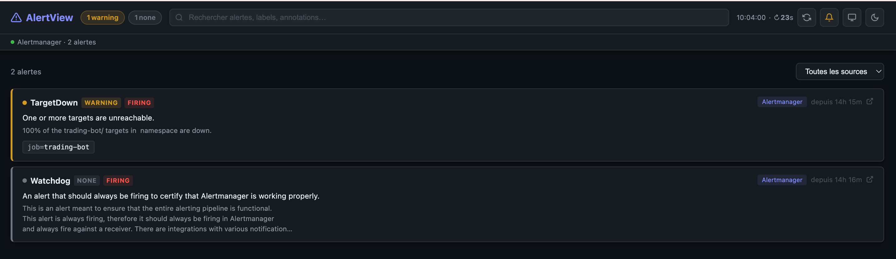

# AlertView

One dashboard for the alerts of Alertmanager, Grafana and Zabbix. A single Rust
binary, no database.

> ⚠️ AlertView has **no authentication**, and its page and API show your alerts
> (host names, labels, messages). Put it behind a reverse proxy with
> authentication and TLS — see [Deployment](docs/deployment.md#reverse-proxy).

## What it does

- Merges the alerts of several Alertmanager, Grafana and Zabbix (6.0 → 7.x)
  sources into one list, sorted by severity.
- Polls the sources itself: ten screens or one make the same load on them.
- **TV mode** for wall screens (`?tv=1`): one dense row per alert, a status bar
  with each source's state.
- Search by label (`team=sre|dba, hostname~web`), filters by severity and
  source, all kept in the URL.
- Links from each alert to your runbook and to the source.
- Sound and desktop notifications for new alerts.
- Says when something is wrong: a source in error, a dashboard that stopped
  updating, a configuration edit that was refused.
- Configuration reloaded on the fly; an unknown option is refused with a clear
  message rather than ignored.

## Quick start

```yaml
# conf/config.yaml
sources:
  - name: "Alertmanager"
    type: alertmanager
    url: "http://alertmanager.example.com:9093"
```

```bash
docker run -d -p 8080:8080 -v $(pwd)/conf:/config:ro ghcr.io/frakev/alertview:latest
```

Then open <http://localhost:8080>. Every option is described in
[`config.example`](config.example).

## Documentation

- [Getting started](docs/getting-started.md)
- [Configuration](docs/configuration.md) and [Display](docs/display.md)
- [Deployment](docs/deployment.md) — Docker, Kubernetes, reverse proxy
- [Troubleshooting](docs/troubleshooting.md)
- [API](docs/api.md) · [Development](docs/development.md) · [CHANGELOG](CHANGELOG.md) · [Security](SECURITY.md)

## Credits

AlertView is maintained by [@frakev](https://github.com/frakev), who designed
it, decided what it should do and runs it in production.

The code itself — the Rust backend, the frontend, the tests and this
documentation — is written by **Claude** (Anthropic), through
[Claude Code](https://claude.com/claude-code), from their specifications and
under their review.

## License

AlertView is released under the [MIT License](LICENSE).

Three emoji icons are Noto Color Emoji artwork, © Google LLC, under the SIL
Open Font License 1.1 — see [THIRD_PARTY_NOTICES.md](THIRD_PARTY_NOTICES.md).
